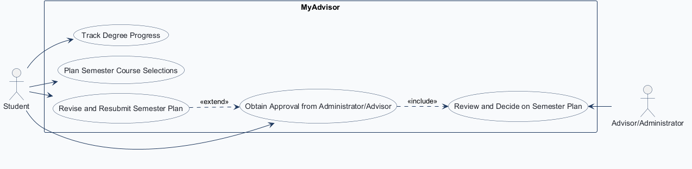
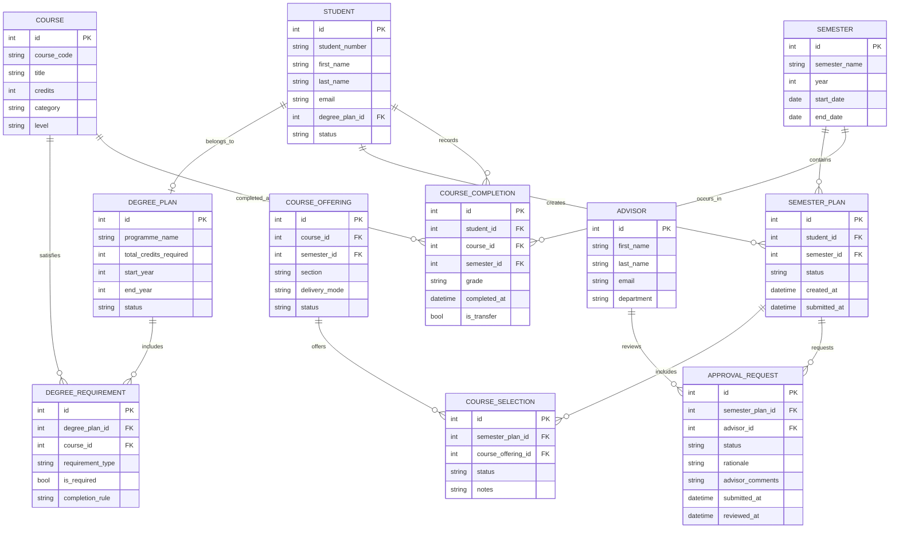

# COMP 3613 Assignment 1

Draft this file with the Guide. **Update it after every phase milestone** before you pause. The use-case diagram is a UML PNG at `docs/diagrams/use-case.png`, linked from this file as `diagrams/use-case.png` (path relative to `docs/report.md`). The model diagram is Mermaid. **Embed wireframe images** as `wireframes/<file>` (files live in `docs/wireframes/`).

Do not put your student ID in this file if you will commit it. The PDF cover adds your name and ID at export time.

## Assigned project

MyAdvisor — track degree progress, plan semester course selections, and obtain approval from an administrator/advisor.

## Three workflows

### 1.

Track degree progress (student)

### 2.

Plan semester course selections (student)

### 3.

Obtain approval from an administrator/advisor (student)

## Use case diagram

Phase 2 notes: Plan Semester Course Selections and Track Degree Progress are separate use cases. Obtaining approval includes the advisor/administrator's review and decision; revising and resubmitting is an optional extension when changes are requested. Student and Advisor/Administrator associations remain separate; no use case is shared by both actors.

## Model diagram

First draft. Update this section in Phase 5 when polish revises the model, and note what changed.

Assumption: a student has one active degree plan, planned semester selections are tied to a course and semester, and advisor approval works as a request/review record rather than direct editing of a student record. 

## Wireframes

### MyAdvisor dashboard, semester planning, and advisor review screens

Phase 4 model edits to consider from the wireframes:
- `DEGREE_PLAN.status — seen on the degree dashboard`
- `DEGREE_PLAN.completed_credits / total_credits_required — seen on the degree progress card`
- `SEMESTER_PLAN.status — seen on the semester plan summary and review list`
- `SEMESTER_PLAN.submitted_at — seen on the submit flow for a planned semester`
- `APPROVAL_REQUEST.status — seen on the advisor review decision panel`
- `APPROVAL_REQUEST.advisor_comments — seen on the advisor review panel`

<!-- student-build:wireframe-coverage
use_case: Track degree progress
image: docs/wireframes/wireframes.png
covered: yes
-->

<!-- student-build:wireframe-coverage
use_case: Plan semester course selections
image: docs/wireframes/wireframes.png
covered: yes
-->

<!-- student-build:wireframe-coverage
use_case: Obtain approval from an administrator/advisor
image: docs/wireframes/wireframes.png
covered: yes
-->

## Theming

Branding preferences and how they were applied (landing / login / register).

## Implementation notes

One named workflow at a time. Include verify notes and polish / model revisions (Phase 5). Do not treat the first build as final.

## Deployed app

Phase 6. Public Render URL (not localhost). Markers open this to mark the three workflows.

https://

## Logins

Every account a marker needs, including extra users you added. Starter accounts:

- bob / bobpass — regular user
- admin / adminpass — admin

## YouTube URL

## Session transcripts

Filled when the Guide builds the report: the agent writes each Guide chat to `docs/transcripts/<slug>.md` (Copilot Agent, Cursor, or OpenCode). `python manage.py report` packages them. Do not paste chats here during the build.

## Competency (student-judge)

Filled when the report is built. Guide runs student-judge, writes `docs/judge.md`, and export appends the scorecard here.

## Skill integrity

Filled by `python manage.py report`. Do not edit the course skills.
