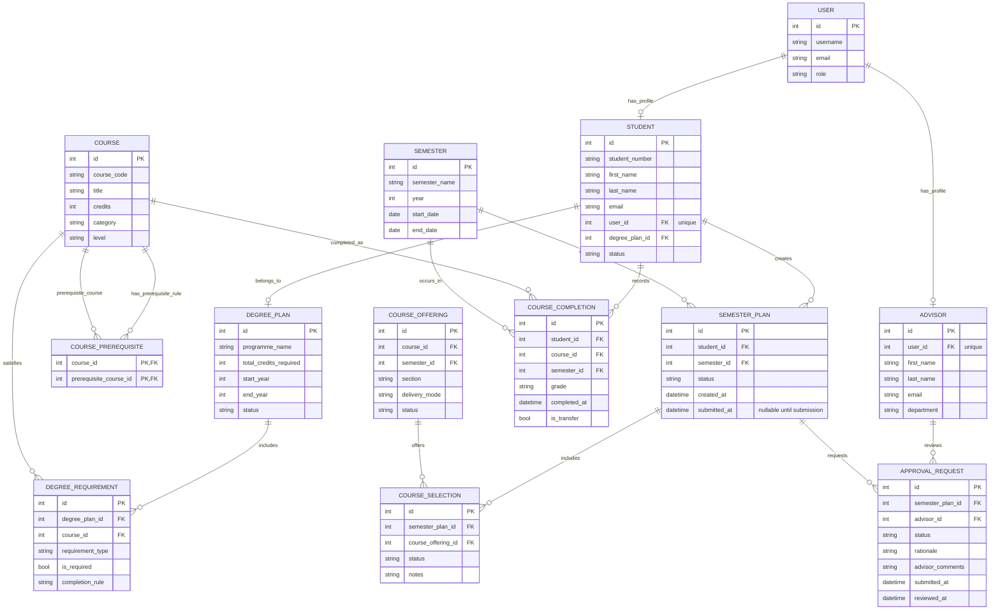

# COMP 3613 Assignment 1

Draft this file with the Guide. **Update it after every phase milestone** before you pause. The use-case diagram is a UML PNG at `docs/diagrams/use-case.png`, linked from this file as `diagrams/use-case.png` (path relative to `docs/report.md`). The model diagram is Mermaid. **Embed wireframe images** as `wireframes/<file>` (files live in `docs/wireframes/`).

Do not put your student ID in this file if you will commit it. The PDF cover adds your name and ID at export time.

## Assigned project

MyAdvisor — track degree progress, plan semester course selections, and obtain approval from an administrator/advisor.

## Three workflows

### 1.

Track degree progress (student)

### 2.

Plan semester course selections (student)

### 3.

Obtain approval from an administrator/advisor (student)

## Use case diagram

Phase 2 notes: Plan Semester Course Selections and Track Degree Progress are separate use cases. Obtaining approval includes the advisor/administrator's review and decision; revising and resubmitting is an optional extension when changes are requested. Student and Advisor/Administrator associations remain separate; no use case is shared by both actors.

## Model diagram

Phase 5 revisions: linked student and advisor profiles to authenticated accounts, added a course-prerequisite bridge, and kept semester submission time nullable until submit.

Assumption: a student has one active degree plan, planned semester selections are tied to a course and semester, and advisor approval works as a request/review record rather than direct editing of a student record. 

## Wireframes

### MyAdvisor dashboard, semester planning, and advisor review screens

Phase 4 model edits to consider from the wireframes:
- `DEGREE_PLAN.status — seen on the degree dashboard`
- `DEGREE_PLAN.completed_credits / total_credits_required — seen on the degree progress card`
- `SEMESTER_PLAN.status — seen on the semester plan summary and review list`
- `SEMESTER_PLAN.submitted_at — seen on the submit flow for a planned semester`
- `APPROVAL_REQUEST.status — seen on the advisor review decision panel`
- `APPROVAL_REQUEST.advisor_comments — seen on the advisor review panel`

<!-- student-build:wireframe-coverage
use_case: Track degree progress
image: docs/wireframes/wireframes.png
covered: yes
-->

<!-- student-build:wireframe-coverage
use_case: Plan semester course selections
image: docs/wireframes/wireframes.png
covered: yes
-->

<!-- student-build:wireframe-coverage
use_case: Obtain approval from an administrator/advisor
image: docs/wireframes/wireframes.png
covered: yes
-->

## Theming

MyAdvisor uses a burgundy and muted-gold palette on warm off-white surfaces, with a clean sans-serif system font. The tone is academic, trustworthy, calm, and comfortable. A minimal degree-progress ring and graduation-cap mark accompanies the MyAdvisor wordmark.

Applied the shared brand tokens to the public landing page, sign-in and registration forms, and authenticated shell. Replaced the starter landing copy and decorative theme with MyAdvisor's degree-planning purpose.
Phase 5 polish: sign-in and registration now use a larger, high-contrast arrow-only link back to the MyAdvisor landing page, with an accessible label and keyboard focus styling.
The MyAdvisor logo and wordmark are centered in the sign-in and registration panels; the back arrow remains separately aligned at the left.
Student confirmed the sign-in and registration alignment looks right.
Landing-page Degree Progress preview labels updated as requested: “BSc Winning at Life,” “Core Course,” and “Elective Course.”

## Implementation notes

### Track degree progress (student)

- Completed credits are calculated from completed course records, counting each distinct course once; they are not stored as a second total on `DEGREE_PLAN`.
- `STUDENT.user_id` is a unique foreign key to the authenticated `USER` account.
- Initialization seeds `bob` with a sample degree plan, course completion history, and outstanding core requirements; seeding is skipped when his student profile already exists.
- The dashboard summary and degree detail view show progress, completed course codes/status/grades, and outstanding required courses. A missing student profile is shown explicitly.
- Student verification: landing page loaded. Dashboard feedback: the progress card was too large, and the bottom Degree shortcut duplicated the detail action where the current semester plan belongs. The card width has been reduced again; the current-plan panel is part of the semester-planning workflow.
- After the first adjustment, the student reported the boxes now felt too narrow horizontally. They reported no visible change after the first widening attempt, so both cards now have an explicit 56rem responsive width and the stylesheet URL was versioned to bust browser cache. Student confirmed the cards look wider and that initialization and semester-plan screens work.
- The student later confirmed the revised dashboard width and reported the implemented screens looked right.

<!-- student-build:code-check
workflow: Track degree progress
form: choice
layer: other
architecture_ok: yes
implement_confidence: 0.75
passed: yes
note: Chose to derive earned credits from completed course records.
-->

<!-- student-build:code-check
workflow: Track degree progress
form: choice
layer: model
architecture_ok: yes
implement_confidence: 0.75
passed: yes
note: Chose a separate student record linked uniquely to the authenticated account.
-->

<!-- student-build:code-check
workflow: Track degree progress
form: choice
layer: other
architecture_ok: yes
implement_confidence: 0.75
passed: yes
note: Chose sample academic records for the existing bob demo account.
-->

<!-- student-build:code-check
workflow: Track degree progress
form: snippet
layer: model
architecture_ok: yes
implement_confidence: 0.75
passed: yes
note: Added the unique Student-to-User foreign key field.
-->

<!-- student-build:code-check
workflow: Track degree progress
form: snippet
layer: router
architecture_ok: yes
implement_confidence: 0.75
passed: yes
note: Thin handler constructs repository and service and passes the result to the template; no query logic in route.
-->

### Plan semester course selections (student)

- Students choose when to start a plan; each semester offering is listed as its own selectable course row.
- The student added nullable `SEMESTER_PLAN.submitted_at` and a route that delegates editor loading through the repository/service layers.
- The service snippet represents an unlinked student account as an explicit page state.
- Added a self-referencing `COURSE_PREREQUISITE` bridge so the pre-submit summary can check course prerequisites.
- The semester editor supports searching offerings, adding/removing sections, saving drafts, and reviewing credits/prerequisite warnings before submission. `My Plans` lists plan history and details.
- The dashboard now shows the current plan and draft status with View/Edit, or Start when no plan exists. Initialization seeds Bob with a draft plan and sample offerings.
- Existing databases upgrade the `semester_plan.submitted_at` column on initialization, so `python manage.py init --no-drop` preserves existing data.
- Existing databases also add the `advisor.user_id` association and unique index during no-drop initialization before creating the seeded admin reviewer profile.
- Submission records `under_review` and `submitted_at`; advisor decisions remain in the next named workflow.
- Student confirmed initialization and the Semester Plan/My Plans workflow worked; dashboard width was polished again at their request and confirmed visually. Current-plan status, editor, and history screens were accepted.
- The Semester Plan tab opens the course-planning workflow with separate academic-year and semester selectors, matching the wireframe. Opening a term starts a draft if none is active; an existing draft/revision is reused. When a term only has submitted/reviewed plans, a new draft is created without replacing those history rows. The model no longer limits each student to one plan per semester. Drafts appear in My Plans and can be edited or deleted; submitted/reviewed plans stay in history as view-only.
- The student reported that the previous My Plans add control and reviewed-plan edit/delete controls were absent. The wireframe shows previous reviewed plans as View-only; the workflow was redirected to Semester Plan with the year/semester selectors instead. A subsequent My Plans 500 was traced to passing `plan_id` as a path parameter for a query-parameter route; affected links now encode it as a query parameter. Student verified a new draft can be saved, appears as a separate My Plans row, and can be edited/deleted; the existing approved/rejected row remains unchanged.
- Student requested Semesters 2 and 3 and more academic years; selected a five-academic-year horizon and chose to offer the demo course catalogue in each semester. The selector creates the three term records per academic year as needed and offers five academic years from the current academic year. The Semester dropdown has exactly three unique options (Semester 1, 2, and 3); the Academic Year selector determines which year's matching term is opened. Demo offerings are copied from the earliest semester with open offerings into generated terms that have none. Semester 3 uses a May–August date range following the existing Semester 1/2 seed schedule. Student confirmed the dropdown now shows only one option for each semester number and that selecting the academic year continues to target the matching term.
- Student reported that opening Semester Plan automatically created a visible draft. New plans now begin in an internal `planning` state, stay out of My Plans, and become `draft` only when Save as Draft is clicked. Course edits and submit-for-approval remain available while planning; revisiting the tab reuses the active unsaved plan and its selected courses. Student verified the plan stays out of My Plans before saving and appears as a draft after clicking Save as Draft.
- Student requested removal of the Open semester button and a fixed side navigation. Removed the redundant button; year/term dropdown changes already submit the selector form. The authenticated sidebar is fixed to the viewport, with content offset on desktop and overlay behavior retained on mobile. After the student reported a needless sidebar scrollbar, changed it to clip overflow so the fixed nav has no internal scroll bar; student confirmed fixed positioning after forcing the updated stylesheet to load.
- Student requested dashboard degree-progress and semester-plan cards be as wide as the Welcome top bar. Expanded only those student dashboard cards to the authenticated content edges, preserving their existing narrower width on other pages. Bumped the stylesheet cache version; student confirmed the cards line up with the welcome bar.
- Admin dashboard review queue card now shares the Welcome bar width, is informational rather than a clickable button/link, and uses the requested Review Plans instruction.

<!-- student-build:code-check
workflow: Plan semester course selections
form: choice
layer: other
architecture_ok: yes
implement_confidence: 0.75
passed: yes
note: Chose to show a Start action until the student saves a plan.
-->

<!-- student-build:code-check
workflow: Plan semester course selections
form: choice
layer: model
architecture_ok: yes
implement_confidence: 0.75
passed: yes
note: Chose a separate row for each course offering/section.
-->

<!-- student-build:code-check
workflow: Plan semester course selections
form: choice
layer: model
architecture_ok: yes
implement_confidence: 0.60
passed: yes
note: Chose a course-to-course prerequisite bridge for pre-submit validation.
-->

<!-- student-build:code-check
workflow: Plan semester course selections
form: snippet
layer: model
architecture_ok: yes
implement_confidence: 0.75
passed: yes
note: Added a nullable submission timestamp so draft plans have no submission time.
-->

<!-- student-build:code-check
workflow: Plan semester course selections
form: snippet
layer: router
architecture_ok: yes
implement_confidence: 0.65
passed: partial
note: First route attempt used an awaited method that did not match the synchronous service contract.
-->

<!-- student-build:code-check
workflow: Plan semester course selections
form: snippet
layer: router
architecture_ok: yes
implement_confidence: 0.65
passed: yes
note: Rewrote handler to call the synchronous service and pass editor data to the template.
-->

<!-- student-build:code-check
workflow: Plan semester course selections
form: snippet
layer: service
architecture_ok: yes
implement_confidence: 0.60
passed: partial
note: Initial missing-profile branch raised an unhandled ValueError.
-->

<!-- student-build:code-check
workflow: Plan semester course selections
form: snippet
layer: service
architecture_ok: yes
implement_confidence: 0.60
passed: yes
note: Revised missing-profile branch to return an explicit page-state message.
-->

<!-- student-build:code-check
workflow: Plan semester course selections
form: snippet
layer: service
architecture_ok: yes
implement_confidence: 0.60
passed: yes
note: Service coordinates editor data through repository methods; no SQL in service.
-->

<!-- student-build:code-check
workflow: Plan semester course selections
form: choice
layer: other
architecture_ok: yes
implement_confidence: 0.75
passed: yes
note: Chose to restrict deletion to draft plans; submitted/reviewed plans stay in history.
-->

<!-- student-build:code-check
workflow: Plan semester course selections
form: snippet
layer: model
architecture_ok: yes
implement_confidence: 0.60
passed: partial
note: First attempt made student_id and semester_id individually unique; corrected to composite uniqueness.
-->

<!-- student-build:code-check
workflow: Plan semester course selections
form: snippet
layer: model
architecture_ok: yes
implement_confidence: 0.60
passed: yes
note: Kept a named composite uniqueness constraint so a student can hold plans in different semesters.
-->

<!-- student-build:code-check
workflow: Plan semester course selections
form: snippet
layer: router
architecture_ok: yes
implement_confidence: 0.60
passed: yes
note: Thin delete handler delegates to the plan service and reports expected errors.
-->

<!-- student-build:code-check
workflow: Plan semester course selections
form: snippet
layer: service
architecture_ok: yes
implement_confidence: 0.60
passed: yes
note: Service checks student ownership and draft status before delegating deletion.
-->

<!-- student-build:code-check
workflow: Plan semester course selections
form: snippet
layer: repository
architecture_ok: yes
implement_confidence: 0.60
passed: partial
note: First repository attempt left selected-course rows and tried refreshing a deleted plan.
-->

<!-- student-build:code-check
workflow: Plan semester course selections
form: snippet
layer: repository
architecture_ok: yes
implement_confidence: 0.60
passed: partial
note: Second repository attempt still deleted only the parent plan.
-->

<!-- student-build:code-check
workflow: Plan semester course selections
form: snippet
layer: repository
architecture_ok: yes
implement_confidence: 0.60
passed: yes
note: Deletes the plan's selected-course rows before deleting and committing the draft.
-->

<!-- student-build:code-check
workflow: Plan semester course selections
form: open
layer: other
architecture_ok: yes
implement_confidence: 0.70
passed: yes
note: Asked for the Semester Plan tab to start planning with separate academic-year and semester selectors, following the wireframe; an active draft is reused to avoid duplicate drafts.
-->

<!-- student-build:code-check
workflow: Plan semester course selections
form: choice
layer: model
architecture_ok: yes
implement_confidence: 0.70
passed: yes
note: Kept reviewed plan history while allowing one active draft for the same student and semester.
-->

<!-- student-build:code-check
workflow: Plan semester course selections
form: open
layer: router
architecture_ok: yes
implement_confidence: 0.70
passed: yes
note: Reported My Plans NoMatchFound traceback; fixed template links to include plan_id in the query string.
-->

<!-- student-build:code-check
workflow: Plan semester course selections
form: open
layer: other
architecture_ok: yes
implement_confidence: 0.80
passed: yes
note: Student verified a new draft saves as a separate row, supports Edit/Delete, and leaves the approved/rejected history row unchanged.
-->

<!-- student-build:code-check
workflow: Plan semester course selections
form: open
layer: model
architecture_ok: yes
implement_confidence: 0.60
passed: yes
note: Chose a CoursePrerequisite bridge to represent the wireframe's prerequisite validation.
-->

### Obtain approval from an administrator/advisor (student)

- Chose a shared administrator review queue rather than assigning each request to one reviewer in advance.
- `ADVISOR.user_id` links a reviewer profile to an administrator account. The demo seed creates an advisor profile for `admin`.
- Submitting a semester plan creates a pending `APPROVAL_REQUEST`. Administrators can review the student, degree progress, semester, and selected offerings, then approve, request revision, or reject.
- Revision and rejection require advisor comments; decisions update both request and semester-plan statuses, record the reviewer and review time, and return the student to their plans. Revision comments appear in the student's plan editor and plan detail for resubmission.
- Student verified that submitted plans appear in the administrator queue, approval updates the workflow, and revision comments are visible to Bob.

<!-- student-build:code-check
workflow: Obtain approval from an administrator/advisor
form: choice
layer: other
architecture_ok: yes
implement_confidence: 0.75
passed: yes
note: Chose a shared administrator review queue.
-->

<!-- student-build:code-check
workflow: Obtain approval from an administrator/advisor
form: snippet
layer: model
architecture_ok: yes
implement_confidence: 0.75
passed: yes
note: Added unique Advisor-to-User account association.
-->

<!-- student-build:code-check
workflow: Obtain approval from an administrator/advisor
form: snippet
layer: router
architecture_ok: yes
implement_confidence: 0.75
passed: yes
note: Pending-review route calls the approval service and returns rows to its template.
-->

## Deployed app

Phase 6. Public Render URL (not localhost). Markers open this to mark the three workflows.

https://

## Logins

Every account a marker needs, including extra users you added. Starter accounts:

- bob / bobpass — regular user
- admin / adminpass — admin

## YouTube URL

## Session transcripts

Filled when the Guide builds the report: the agent writes each Guide chat to `docs/transcripts/<slug>.md` (Copilot Agent, Cursor, or OpenCode). `python manage.py report` packages them. Do not paste chats here during the build.

## Competency (student-judge)

Filled when the report is built. Guide runs student-judge, writes `docs/judge.md`, and export appends the scorecard here.

## Skill integrity

Filled by `python manage.py report`. Do not edit the course skills.
